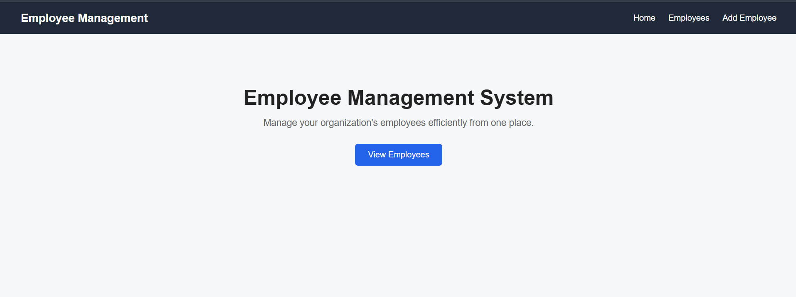
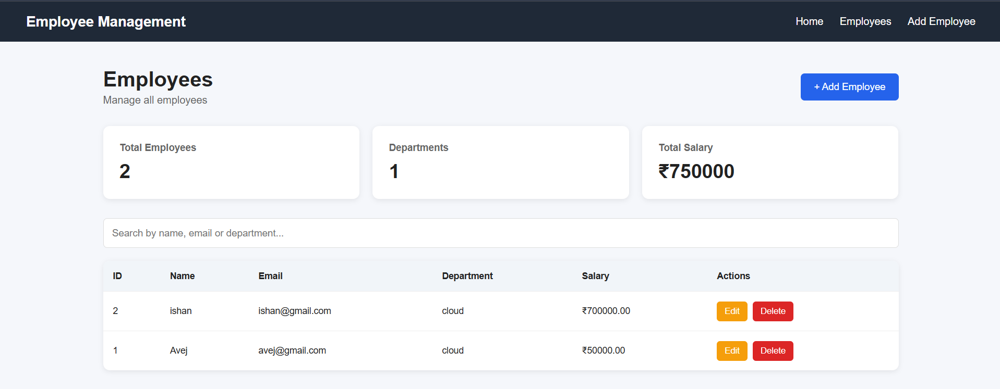
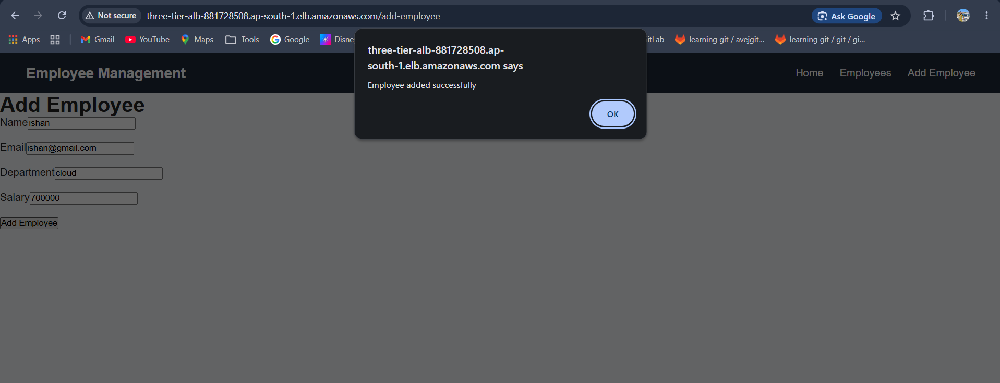

# AWS Three-Tier Employee Management System

A three-tier web application deployed on AWS using **Terraform modules**, **Docker**, **React**, **Node.js/Express**, **Amazon RDS MySQL**, and an **Application Load Balancer**.

The project demonstrates how to provision AWS infrastructure using Terraform modules and deploy a Dockerized frontend and backend application on a private EC2 instance.

---

# Project Overview

This project implements an **Employee Management System** using a three-tier AWS architecture.

The application consists of:

- **Frontend:** React + Vite
- **Backend:** Node.js + Express
- **Database:** Amazon RDS MySQL
- **Containerization:** Docker + Docker Compose
- **Infrastructure:** AWS + Terraform
- **Load Balancing:** Application Load Balancer
- **EC2 Management:** AWS Systems Manager Session Manager

The application is accessible from the internet through the **Application Load Balancer URL**.

The EC2 instance and RDS database are deployed in private subnets.

---

# Requirements

The project was created according to the following requirements:

### Infrastructure

- VPC
- 2 Public Web Subnets
- 2 Private Application Subnets
- 2 Private Database Subnets
- Internet Gateway
- NAT Gateway
- Application Load Balancer
- Private EC2 instance
- Amazon RDS MySQL

### Security

Separate Security Groups are used for:

- Application Load Balancer
- Application/EC2
- Database/RDS

Traffic between the layers is restricted.

### Application

The application contains:

- React frontend
- Node.js/Express backend
- Amazon RDS MySQL database

### Deployment

- Terraform modules
- Docker
- Docker Compose
- EC2 User Data
- AWS Systems Manager

---

# Architecture

## Three-Tier Architecture

```text
                              INTERNET
                                  |
                                  |
                            HTTP / HTTPS
                                  |
                                  v
                    +-------------------------+
                    | Application Load        |
                    | Balancer (ALB)          |
                    |                         |
                    | Public Subnet 1         |
                    | Public Subnet 2         |
                    +------------+------------+
                                 |
                                 | HTTP :80
                                 |
                                 v
             +-----------------------------------------+
             |       PRIVATE APPLICATION LAYER         |
             |                                         |
             |  Application Subnet 1                   |
             |  Application Subnet 2                   |
             |                                         |
             |             EC2 Instance                |
             |                                         |
             |        Docker Compose                   |
             |                                         |
             |   +-------------------------------+     |
             |   | React + Nginx                 |     |
             |   | Port 80                       |     |
             |   +---------------+---------------+     |
             |                   |                     |
             |                  /api                   |
             |                   |                     |
             |   +---------------v---------------+     |
             |   | Node.js + Express             |     |
             |   | Port 5000                     |     |
             |   +---------------+---------------+     |
             +-------------------|---------------------+
                                 |
                                 | MySQL :3306
                                 |
                                 v
             +-----------------------------------------+
             |         PRIVATE DATABASE LAYER          |
             |                                         |
             |  Database Subnet 1                       |
             |  Database Subnet 2                       |
             |                                         |
             |           Amazon RDS MySQL              |
             |                 :3306                   |
             +-----------------------------------------+


## Application URL

The Employee Management System is accessible through the Application Load Balancer:

**http://three-tier-alb-881728508.ap-south-1.elb.amazonaws.com**

The application is accessed through the public Application Load Balancer, while the EC2 instance hosting the Dockerized application remains in a private application subnet.

---

## Home Page

The following screenshot shows the Employee Management System home page successfully running through the AWS Application Load Balancer.



---

## Employees Page

The Employees page retrieves employee information from the Node.js backend, which communicates with the Amazon RDS MySQL database.

The application successfully displays employee records stored in the RDS database.



---

## Add Employee

The application also supports adding new employees.

When a new employee is submitted, the React frontend sends the request to the Node.js/Express backend through the Nginx reverse proxy. The backend stores the employee information in Amazon RDS MySQL.

The application displays a confirmation message after the employee is successfully added.



---

## Application Request Flow

```text
                         INTERNET
                            |
                            v
              Application Load Balancer
                            |
                            | HTTP :80
                            v
                    Private EC2 Instance
                            |
                     Docker Compose
                            |
              +-------------+-------------+
              |                           |
              v                           v
        React + Nginx              Node.js + Express
          Frontend                     Backend
              |                           |
              | /api                      |
              +-------------------------->|
                                          |
                                          | MySQL :3306
                                          v
                                  Amazon RDS MySQL